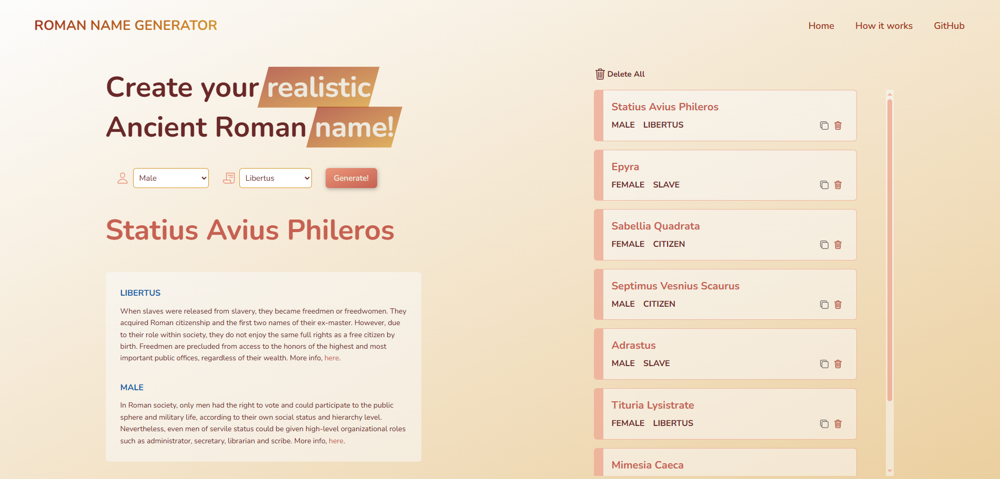

# Roman name generator web-app

## Features 📜

- Users can select the status and the gender in order to generate a new realistic name.
- The generated names are saved in a visible list, displaying the last 20 names for easy reference.
- Users can copy the chosen name by clicking on the copy-icon.
- Names can also be removed from the list.

Link: https://roman-names-generator.netlify.app/

## Tech stack 👩‍💻

- [Roman name generator](https://github.com/erianiel/roman-name-generator)
- React, ReactDOM, ReactRouter
- CSS modules
- Vite
